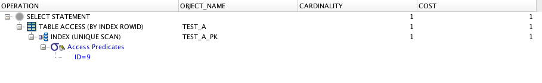
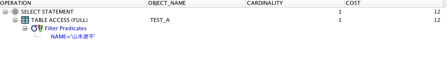
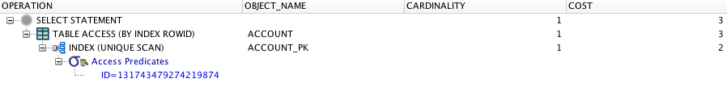
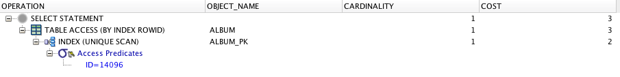
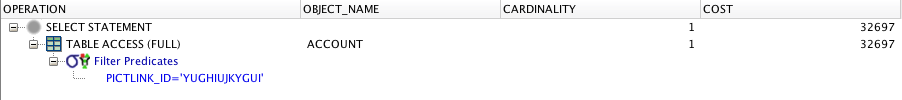
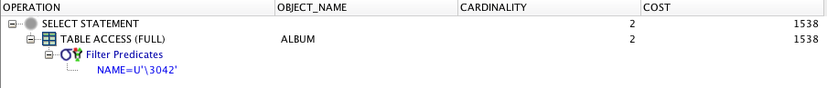
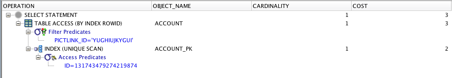
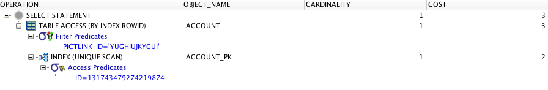

# データベースについて 2015/05/21

## 実行計画

### 実行計画とは
どのような手順で記憶装置のデータにアクセスするかの計画。
SQL文は「何を検索するか」で、実行計画は「どうやって検索するか」

### DBMSのクエリ処理の流れ
SQLクエリを受け取る

↓

クエリをパース（解析）する

↓

実行計画をたくさん立てて、コストを計算する

↓

最適な実行計画を採用する

↓

実行計画をコードに直して実行する

### TEST_Aテーブルでの実行計画の確認
行数9のTEST_Aテーブルで実行計画を確認した。

#### プライマリーキーを用いた条件selectでの実行計画

* CARDINALITYが1、COSTが1だった。
* TABLE ACCESS(BY INDEX ROWID)
* INDEX(UNIQUE SCAN)というのが入っている。

#### プライマリーキー以外を用いた条件selectでの実行計画

* CARDINALITYが1、COSTが12だった。
* TABLE ACCESS(FULL)
* INDEX(UNIQUE SCAN)はない。

#### 二つの比較
COSTは処理にかかるCPU時間。プライマリーキーを使うとインデックスが利用され、処理時間が短く見積もられる。

## インデックス

### 各テーブルの行数確認

    SELECT COUNT(*) FROM TABLE名;

で行数を確認した。

* ACCOUNT: 10561478 8桁
* ALBUM: 908489 6桁
* PROFILE: 11585230 8桁

### インデックスを使用した検索を実施

#### ACCOUNT

    SELECT * FROM ACCOUNT WHERE ID = '131743479274219874';

処理時間は、0.003秒だった。

#### ALBUM

### インデックスを使用しない検索を実施

#### ACCOUNT

    SELECT * FROM ACCOUNT WHERE PICTLINK_ID = 'YUGHIUJKYGUI';

処理時間は、12.7秒だった。

#### ALBUM

### インデックスを使用している列としていない列を組み合わせて検索を実施

#### プライマリーキーから

    SELECT * FROM ACCOUNT WHERE ID = '131743479274219874' AND PICTLINK_ID = 'YUGHIUJKYGUI';

0.003秒

#### 非プライマリーキーから

    SELECT * FROM ACCOUNT WHERE PICTLINK_ID = 'YUGHIUJKYGUI' AND ID = '131743479274219874';

0.001秒

