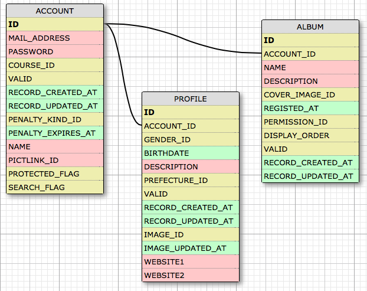
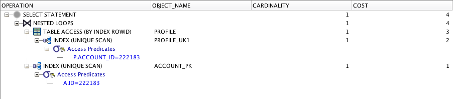
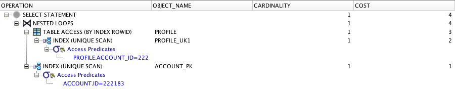
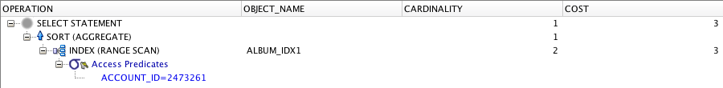
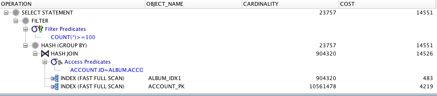

# データベースについて 2015/05/22

## JOIN（結合）

### ER図

「WWW SQL designer」を利用して、ER図を描いてみた。

### 特定アカウントの誕生日を検索
#### 自己結合？

    SELECT a.ID, p.BIRTHDATE FROM ACCOUNT a, PROFILE p WHERE a.ID = 222183 AND p.ACCOUNT_ID = 222183;

0.003秒

#### 内部結合

    SELECT PROFILE.BIRTHDATE FROM ACCOUNT INNER JOIN PROFILE ON ACCOUNT.ID = 222183 AND PROFILE.ACCOUNT_ID = 222183;
	
0.003秒

### 実行計画の確認
#### 自己結合

#### 内部結合

### 結合の種類

#### クロス結合 CROSS JOIN
二つの表の直積を返す。

    TABLE_A CROSS JOIN TABLE_B

のサイズは、(TABLE_Aのサイズ) * (TABLE_Bのサイズ) になる。

#### 内部結合 INNER JOIN
条件に合う行だけ返す。

#### 外部結合 (LEFT, RIGHT) JOIN
条件に合わない行も返す。

    TABLE_A LEFT JOIN TABLE_B

なら、TABLE_Aの内容は全て表示する。条件に合わないTABLE_Bの行はNULLになる。

    TABLE_A RIGHT JOIN TABLE_B

なら、TABLE_Bの内容は全て表示する。条件に合わないTABLE_Aの行はNULLになる。

#### 自己結合
AS を使って、あるテーブルを別のテーブルとして考えて結合する？

#### 自然結合 NATURAL JOIN
等値結合を自動でやってくれる。同じものを表すキーが一致しているものを返す？

## 集計

### ACCOUNT_IDごとにALBUMに登録されている件数をカウント

    SELECT COUNT(*) FROM ALBUM WHERE ACCOUNT_ID=2473261;

結果：9

実行計画は以下。

### アルバム数が100件以上のユーザ一覧を出力
まず、各アカウントのアルバム登録件数の一覧を取得する方法を考えた。

    SELECT ACCOUNT.ID, COUNT(*) 
	FROM ACCOUNT INNER JOIN ALBUM 
	ON ACCOUNT.ID = ALBUM.ACCOUNT_ID 
	GROUP BY ACCOUNT.ID;

で、できた。

次に、これを

    SELECT * 
	FROM (SELECT ACCOUNT.ID, COUNT(*) CNT FROM ACCOUNT INNER JOIN ALBUM ON ACCOUNT.ID = ALBUM.ACCOUNT_ID GROUP BY ACCOUNT.ID) 
	WHERE CNT >= 100;

とすると、アルバム数が100件以上のユーザ一覧を出力できた。実行計画は以下。

